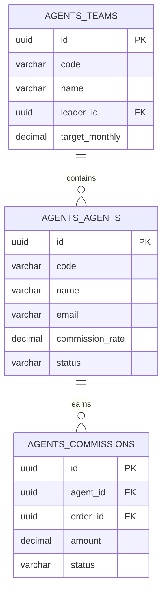
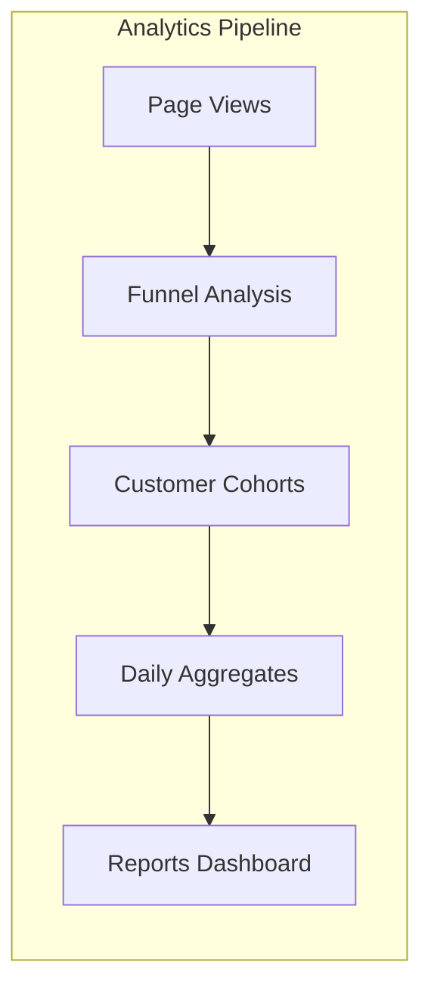
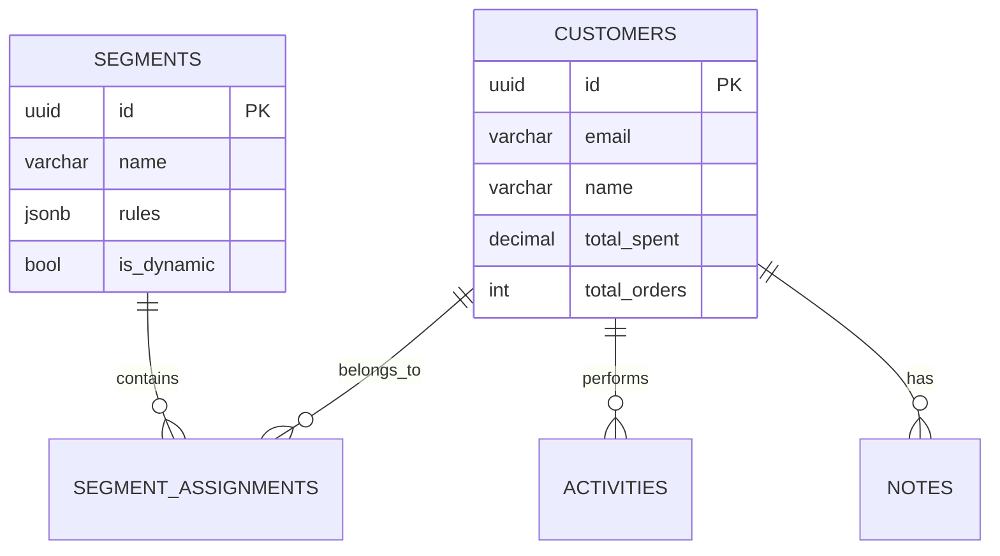
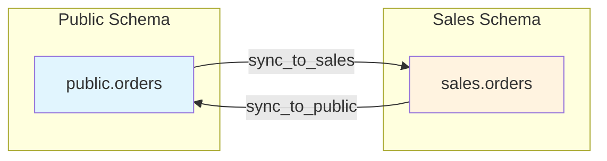
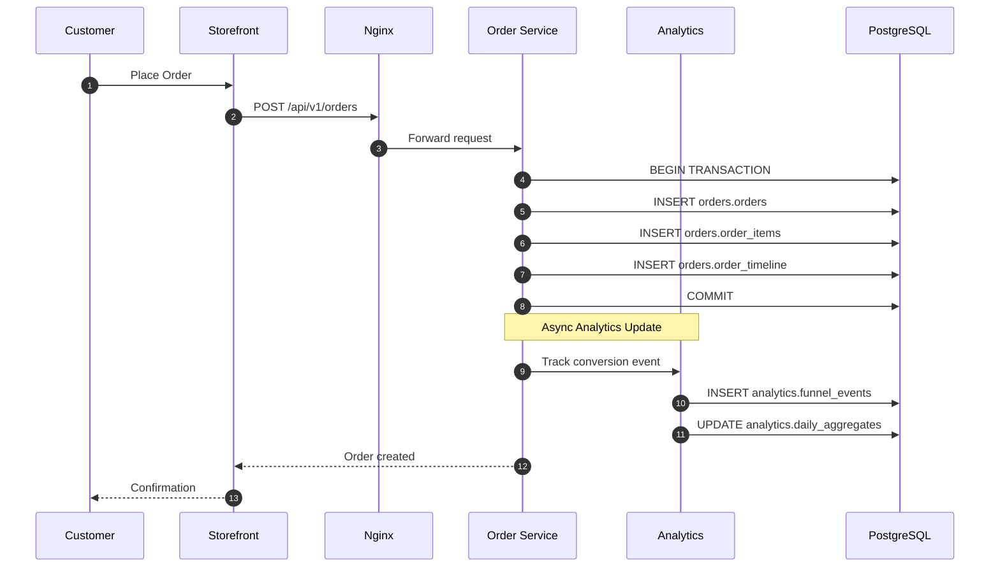
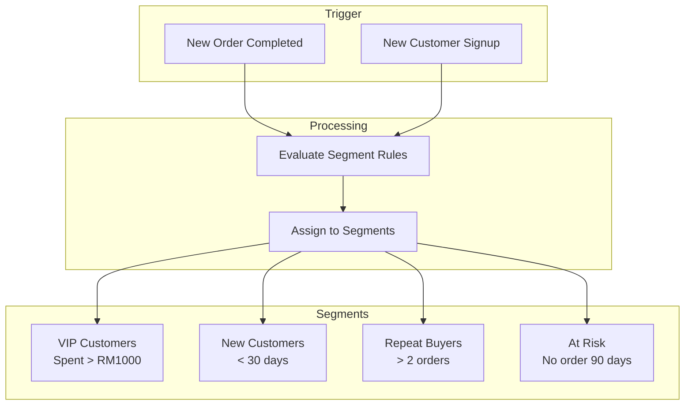
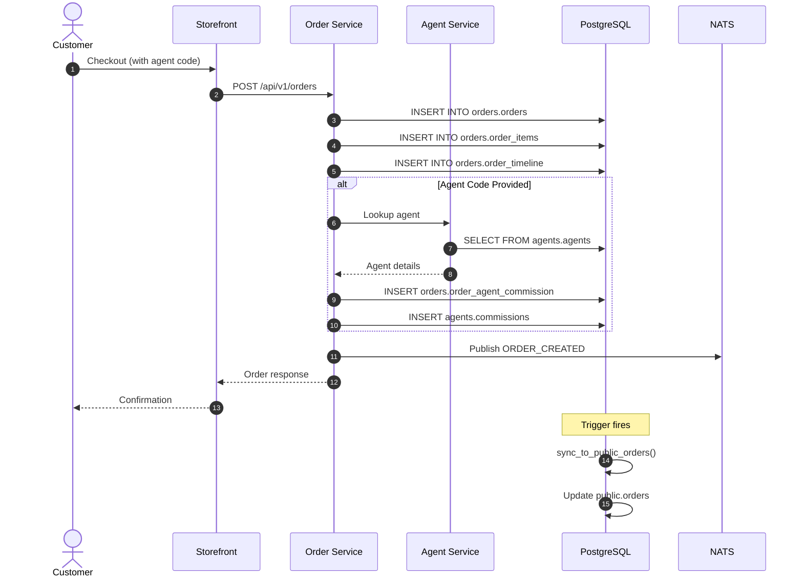

# Kilang Desa Murni Batik - Production Server Architecture Documentation

## Server Information

| Attribute | Value |
|-----------|-------|
| **Server IP** | 72.62.67.167 |
| **Database** | PostgreSQL 16.11 |
| **Deployment** | Docker Compose in /opt/kilang |
| **Export Date** | January 2026 |

---

# Schema Comparison Summary

## Key Differences: Server vs Local

The production server has **evolved** with additional schemas, tables, and functions that are not present in the local development export.

### Additional Schemas on Server (Not in Local)

| Schema | Purpose | Tables |
|--------|---------|--------|
| `agents` | Agent management (DDD bounded context) | agents, commissions, teams |
| `analytics` | Business analytics and tracking | customer_cohorts, daily_aggregates, funnel_events, page_views |
| `customers` | Customer segmentation (DDD bounded context) | customer_activities, customer_notes, customer_segment_assignments, customer_segments, customers |

### Additional Tables on Server

#### `catalog` Schema (Server has products, local does not)

| Table | Purpose |
|-------|---------|
| `catalog.categories` | Product categories (moved from public) |
| `catalog.products` | Product master data (moved from public) |
| `catalog.product_variants` | Product variants (moved from public) |
| `catalog.product_images` | Product images (moved from public) |
| `catalog.discounts` | Discount definitions (moved from public) |
| `catalog.discount_usage` | Discount tracking (moved from public) |
| `catalog.newsletter_subscribers` | Email subscribers (moved from public) |

#### `orders` Schema (Server has extended order tables)

| Table | Purpose |
|-------|---------|
| `orders.order_agent_commission` | Agent commission per order |
| `orders.order_payments` | Payment records linked to orders |
| `orders.order_pickup` | Pickup scheduling for orders |
| `orders.order_preorder` | Pre-order management |
| `orders.order_shipping` | Shipping details |
| `orders.order_timeline` | Order event timeline |

#### `sales` Schema (Server has duplicated order structure)

| Table | Purpose |
|-------|---------|
| `sales.orders` | Orders (domain copy) |
| `sales.order_items` | Order line items |
| `sales.order_events` | Order events |
| `sales.order_fulfillments` | Fulfillment records |
| `sales.order_notes` | Order notes |
| `sales.order_status_history` | Status changes |
| `sales.return_items` | Return line items |
| `sales.returns` | Return requests |
| `sales.stock_reservations` | Stock reservations |

### Additional Functions on Server

| Function | Schema | Purpose |
|----------|--------|---------|
| `sync_product_stock()` | inventory | Syncs stock across warehouses |
| `sync_order_payment()` | orders | Syncs payment to order |
| `sync_order_shipping()` | orders | Syncs shipping to order |
| `sync_order_timeline()` | orders | Creates timeline entries |
| `get_next_order_number()` | sales | Generates sequential order numbers |
| `sync_from_public_orders()` | sales | Syncs from public.orders to sales.orders |
| `sync_to_public_orders()` | sales | Syncs from sales.orders to public.orders |
| `update_order_with_version()` | sales | Optimistic locking update |

### Additional Views on Server

| View | Purpose |
|------|---------|
| `public.orders_full_view` | Full order details with joins |

---

# 1. System Overview (Production Server)

## 1.1 What the Production System Does

The production server hosts the complete **Kilang Desa Murni Batik** e-commerce platform with:

- **17 Database Schemas** (vs 14 in local)
- **120+ Tables** (vs ~90 in local)
- **25+ Functions** (vs ~15 in local)
- **3 Views** (vs 2 in local)

## 1.2 Production Business Capabilities

| Capability | Status | Notes |
|------------|--------|-------|
| Online Storefront | ✅ Active | Customer shopping |
| Admin Dashboard | ✅ Active | Staff management |
| Agent Portal | ✅ Active | Sales rep management |
| Warehouse Management | ✅ Active | Inventory operations |
| Analytics Dashboard | ✅ Active | **NEW** - Business intelligence |
| Customer Segmentation | ✅ Active | **NEW** - Marketing segments |
| Marketplace Sync | ✅ Active | Shopee/TikTok integration |

---

# 2. Production Architecture Diagram

```mermaid
flowchart TB
    subgraph Clients["Client Applications"]
        WEB["Web Storefront<br/>store.kilangdesamurnibatik.com"]
        ADMIN["Admin Dashboard<br/>admin.kilangdesamurnibatik.com"]
        WAREHOUSE["Warehouse Portal"]
    end

    subgraph Gateway["API Gateway"]
        NGINX["Nginx<br/>72.62.67.167:80/443"]
    end

    subgraph Services["Backend Services (Docker)"]
        AUTH["Auth :8001"]
        CATALOG["Catalog :8002"]
        INVENTORY["Inventory :8003"]
        CUSTOMER["Customer :8004"]
        ORDER["Order :8005"]
        AGENT["Agent :8006"]
        REPORTING["Reporting :8007"]
        NOTIFICATION["Notification :8008"]
        SUPPORT["Support :8009"]
        MARKETPLACE["Marketplace :8010"]
    end

    subgraph DataLayer["Data Layer"]
        subgraph PostgreSQL["PostgreSQL 16.11"]
            direction TB
            SCH_AUTH["auth"]
            SCH_CATALOG["catalog"]
            SCH_INV["inventory"]
            SCH_ORDERS["orders"]
            SCH_SALES["sales"]
            SCH_AGENTS["agents ⭐"]
            SCH_ANALYTICS["analytics ⭐"]
            SCH_CUSTOMERS["customers ⭐"]
            SCH_CMS["cms"]
            SCH_MKT["marketplace"]
            SCH_PAY["payments"]
        end
        REDIS[("Redis")]
        MINIO[("MinIO")]
        MEILI[("Meilisearch")]
        NATS[("NATS")]
    end

    subgraph External["External Services"]
        CURLEC["Curlec Payment"]
        EASYPARCEL["EasyParcel Shipping"]
        SHOPEE["Shopee API"]
        TIKTOK["TikTok Shop API"]
    end

    WEB --> NGINX
    ADMIN --> NGINX
    WAREHOUSE --> NGINX

    NGINX --> AUTH
    NGINX --> CATALOG
    NGINX --> INVENTORY
    NGINX --> CUSTOMER
    NGINX --> ORDER
    NGINX --> AGENT
    NGINX --> REPORTING
    NGINX --> NOTIFICATION
    NGINX --> SUPPORT
    NGINX --> MARKETPLACE

    AUTH --> PostgreSQL
    CATALOG --> PostgreSQL
    INVENTORY --> PostgreSQL
    ORDER --> PostgreSQL
    AGENT --> PostgreSQL
    REPORTING --> PostgreSQL
    MARKETPLACE --> PostgreSQL

    ORDER --> CURLEC
    ORDER --> EASYPARCEL
    MARKETPLACE --> SHOPEE
    MARKETPLACE --> TIKTOK
```



**⭐ = New schemas only on production server**

---

# 3. Database Schema Breakdown (Production Server)

## 3.1 Complete Schema List

| Schema | Tables | Purpose | Status |
|--------|--------|---------|--------|
| `agent` | 0 | Legacy (empty) | Deprecated |
| `agents` | 3 | Agent bounded context | **Server Only** |
| `analytics` | 4 | Business analytics | **Server Only** |
| `auth` | 7 | Authentication/RBAC | Both |
| `catalog` | 14 | Product catalog (extended) | Extended |
| `cms` | 10 | Content management | Both |
| `crm` | 1 | Customer relationships | Both |
| `customer` | 4 | Customer profiles | Both |
| `customers` | 5 | Customer segmentation | **Server Only** |
| `inventory` | 5 | Warehouse/stock | Both |
| `marketplace` | 8 | Third-party sync | Both |
| `notification` | 0 | Notifications | Both |
| `orders` | 6 | Order bounded context | **Extended** |
| `outbox` | 1 | Event outbox | Both |
| `payments` | 2 | Payment processing | Both |
| `public` | 40+ | Shared tables | Both |
| `reporting` | 0 | Reporting (views) | Both |
| `sales` | 14 | Sales domain (DDD) | **Extended** |

## 3.2 New `agents` Schema (Server Only)

**Purpose**: Proper DDD bounded context for agent management



## 3.3 New `analytics` Schema (Server Only)

**Purpose**: Business intelligence and customer behavior tracking

| Table | Purpose | Key Columns |
|-------|---------|-------------|
| `customer_cohorts` | Customer grouping by signup date | cohort_date, customer_count, retention_rates |
| `daily_aggregates` | Daily metrics snapshot | date, total_orders, total_revenue, new_customers |
| `funnel_events` | Conversion funnel tracking | event_type, customer_id, timestamp, metadata |
| `page_views` | Page view analytics | page_url, visitor_id, session_id, timestamp |



## 3.4 New `customers` Schema (Server Only)

**Purpose**: Advanced customer segmentation for marketing

| Table | Purpose | Key Columns |
|-------|---------|-------------|
| `customers` | Customer master (domain copy) | id, email, total_orders, total_spent |
| `customer_segments` | Segment definitions | id, name, rules, is_dynamic |
| `customer_segment_assignments` | Customer-segment mapping | customer_id, segment_id |
| `customer_activities` | Customer action log | customer_id, activity_type, metadata |
| `customer_notes` | CRM notes | customer_id, note, created_by |



## 3.5 Extended `orders` Schema (Server Only)

**Purpose**: Order domain extension for better separation of concerns

| Table | Purpose |
|-------|---------|
| `order_agent_commission` | Commission calculation per order |
| `order_payments` | Payment events linked to order |
| `order_pickup` | Self-pickup scheduling |
| `order_preorder` | Pre-order management |
| `order_shipping` | Shipping provider details |
| `order_timeline` | Event timeline (status changes) |

## 3.6 Extended `catalog` Schema (Server Only)

**Production server moved core product tables to `catalog` schema:**

| Table | Local Location | Server Location |
|-------|---------------|-----------------|
| products | public.products | catalog.products |
| product_variants | public.product_variants | catalog.product_variants |
| product_images | public.product_images | catalog.product_images |
| categories | public.categories | catalog.categories |
| discounts | public.discounts | catalog.discounts |

**Why?** Better DDD bounded context separation.

---

# 4. Data Synchronization Triggers (Server Only)

The production server has **bi-directional sync triggers** to maintain data consistency.

## 4.1 Inventory Sync

```sql
-- inventory.sync_product_stock()
-- Automatically syncs total stock to product table
CREATE FUNCTION inventory.sync_product_stock() RETURNS trigger AS $$
BEGIN
    -- Calculate total stock across all warehouses
    SELECT COALESCE(SUM(quantity), 0) INTO total_stock
    FROM inventory.stock_items
    WHERE product_id = NEW.product_id;

    -- Update product stock_quantity
    UPDATE catalog.products SET stock_quantity = total_stock
    WHERE id = NEW.product_id;

    RETURN NEW;
END;
$$ LANGUAGE plpgsql;
```

## 4.2 Order Sync (sales ↔ public)



**Purpose**: Allow services to write to either schema while maintaining consistency.

---

# 5. Request Flow (Production Server)

## 5.1 Order Creation with Analytics



## 5.2 Customer Segmentation Flow



---

# 6. Sequence Diagram - Full Order with Commission



---

# 7. Error Handling (Production)

## 7.1 Database Sync Failure

| Scenario | Handling |
|----------|----------|
| Trigger fails | Transaction rolls back |
| Sync mismatch | Logged to outbox.events |
| Constraint violation | Return error to client |

## 7.2 Optimistic Locking (Server Only)

```sql
-- sales.update_order_with_version()
-- Prevents race conditions on order updates
SELECT sales.update_order_with_version(
    p_order_id := 'uuid',
    p_expected_version := 5,
    p_status := 'shipped'
);
-- Returns FALSE if version mismatch (concurrent update)
```

---

# 8. Security (Production Server)

## 8.1 Same as Local

- JWT authentication
- RBAC with permissions
- bcrypt password hashing
- TLS 1.3 via Nginx

## 8.2 Additional Production Security

| Feature | Implementation |
|---------|---------------|
| **IP Whitelisting** | Nginx geo blocking |
| **Rate Limiting** | Nginx limit_req |
| **WAF** | Cloudflare (if configured) |
| **Audit Logging** | analytics.page_views, outbox.events |

---

# 9. Scalability & Performance

## 9.1 Production Optimizations

| Optimization | Status |
|--------------|--------|
| Database indexes | ✅ Extended |
| Query caching (Redis) | ✅ Active |
| Connection pooling | ✅ GORM pgx |
| Read replicas | ❌ Not yet |
| CDN | ⚠️ Partial |

## 9.2 Analytics Performance

The `analytics` schema uses **pre-aggregated daily tables** to avoid heavy queries:

```sql
-- Instead of: SELECT COUNT(*) FROM orders WHERE date = today
-- Query: SELECT total_orders FROM analytics.daily_aggregates WHERE date = today
```

---

# 10. Migration Path: Local → Server

To sync your local development environment with production:

## 10.1 Missing Schemas to Add

```sql
-- Run these on local to match server
CREATE SCHEMA IF NOT EXISTS agents;
CREATE SCHEMA IF NOT EXISTS analytics;
CREATE SCHEMA IF NOT EXISTS customers;
```

## 10.2 Missing Tables to Create

Priority tables to add locally:

1. **analytics.daily_aggregates** - For reporting
2. **analytics.funnel_events** - For conversion tracking
3. **customers.customer_segments** - For marketing
4. **orders.order_timeline** - For order history UI

## 10.3 Schema Migration Script

```bash
# Export only new tables from server
ssh root@72.62.67.167 "docker exec kilang-postgres pg_dump -U kilang -d kilang_batik \
    --schema=agents --schema=analytics --schema=customers \
    --schema-only" > new_schemas.sql

# Import to local
psql -U kilang -d kilang_batik -f new_schemas.sql
```

---

# Appendix A: Complete Table Count Comparison

| Schema | Local Tables | Server Tables | Difference |
|--------|-------------|---------------|------------|
| agent | 0 | 0 | - |
| agents | 0 | 3 | +3 |
| analytics | 0 | 4 | +4 |
| auth | 7 | 7 | - |
| catalog | 8 | 14 | +6 |
| cms | 10 | 10 | - |
| crm | 1 | 1 | - |
| customer | 4 | 4 | - |
| customers | 0 | 5 | +5 |
| inventory | 5 | 5 | - |
| marketplace | 8 | 8 | - |
| notification | 0 | 0 | - |
| orders | 0 | 6 | +6 |
| outbox | 1 | 1 | - |
| payments | 2 | 2 | - |
| public | ~40 | ~40 | - |
| reporting | 0 | 0 | - |
| sales | 4 | 14 | +10 |
| **TOTAL** | **~90** | **~124** | **+34** |

---

# Appendix B: Function Comparison

## Server-Only Functions

| Function | Schema | Purpose |
|----------|--------|---------|
| `sync_product_stock()` | inventory | Aggregate stock across warehouses |
| `sync_order_payment()` | orders | Link payment to order |
| `sync_order_shipping()` | orders | Link shipping to order |
| `sync_order_timeline()` | orders | Create timeline entry |
| `get_next_order_number()` | sales | Sequential order number |
| `sync_from_public_orders()` | sales | Sync trigger |
| `sync_to_public_orders()` | sales | Sync trigger |
| `update_order_with_version()` | sales | Optimistic locking |

---

# Appendix C: View Comparison

| View | Local | Server |
|------|-------|--------|
| `public.v_active_flash_sales` | ✅ | ✅ |
| `public.v_flash_sale_items` | ✅ | ✅ |
| `public.orders_full_view` | ❌ | ✅ |

---

# Document Information

| Attribute | Value |
|-----------|-------|
| **Version** | 1.0 |
| **Server** | 72.62.67.167 |
| **Export Date** | January 2026 |
| **Total Schemas** | 17 |
| **Total Tables** | ~124 |
| **Total Functions** | 25+ |
| **Differences from Local** | +3 schemas, +34 tables, +8 functions |

---

*This document compares the production server database with the local development environment and highlights the additional components present only on the server.*
