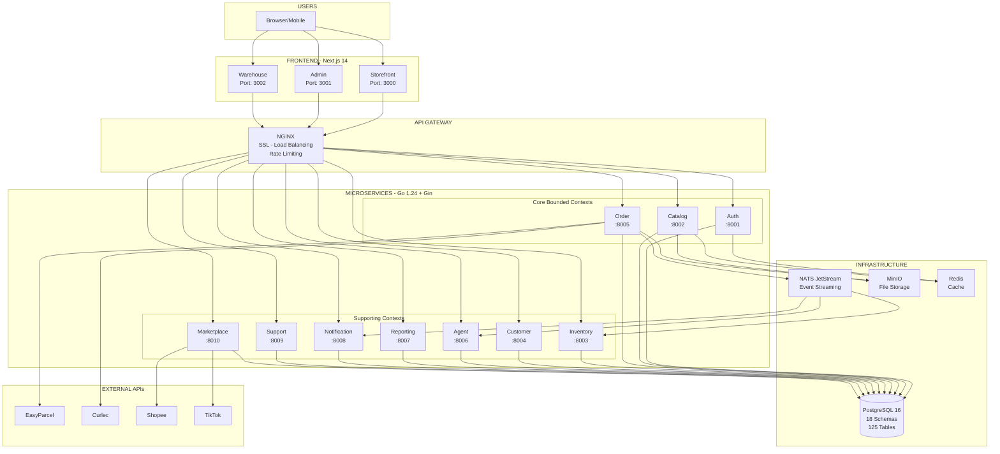
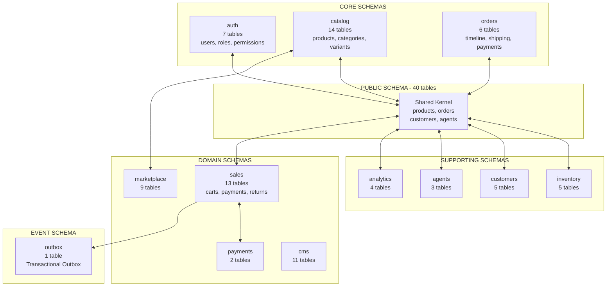
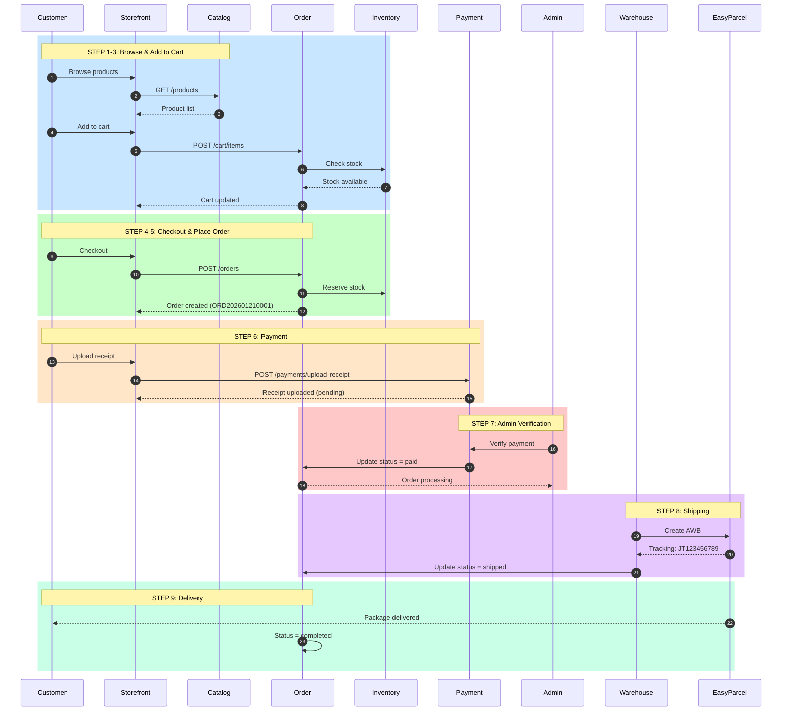
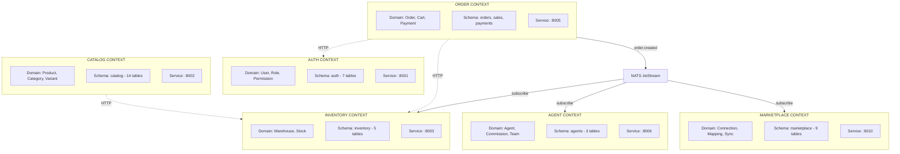
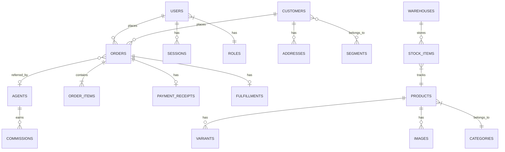
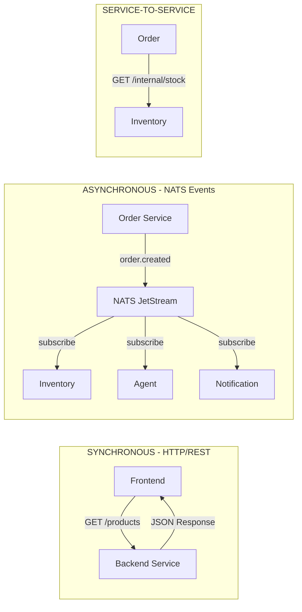

# Kilang Desa Murni Batik - Mermaid Diagrams

> These diagrams can be rendered in GitHub, VS Code, Mermaid Live Editor, or any Mermaid-compatible tool.

## Table of Contents

1. [System Architecture](#1-system-architecture)
2. [Database Schema Map](#2-database-schema-map)
3. [Customer Order Journey](#3-customer-order-journey)
4. [DDD Bounded Contexts](#4-ddd-bounded-contexts)
5. [Entity Relationship Diagram](#5-entity-relationship-diagram)

---

## 1. System Architecture



---

## 2. Database Schema Map



---

## 3. Customer Order Journey



---

## 4. DDD Bounded Contexts



---

## 5. Entity Relationship Diagram



---

## 6. Service Communication Pattern



---

## How to Use These Diagrams

### 1. Mermaid Live Editor (Recommended)
- Go to [mermaid.live](https://mermaid.live)
- Paste the code between ` ```mermaid ` and ` ``` `
- Export as PNG or SVG

### 2. GitHub
- GitHub renders Mermaid diagrams natively in markdown files
- Just push this file and view on GitHub

### 3. VS Code
- Install "Markdown Preview Mermaid Support" extension
- Open this file and press `Ctrl+Shift+V` to preview

### 4. Notion
- Create a code block with language "mermaid"
- Paste the diagram code

---

## Color Scheme Reference

| Element | Suggested Color | Hex Code |
|---------|----------------|----------|
| Frontend (Next.js) | Blue | `#3B82F6` |
| API Gateway (Nginx) | Orange | `#F97316` |
| Microservices (Go) | Teal | `#14B8A6` |
| Database (PostgreSQL) | Purple | `#8B5CF6` |
| Messaging (NATS) | Green | `#22C55E` |
| Storage (MinIO) | Yellow | `#EAB308` |
| External APIs | Gray | `#6B7280` |

---

*Document Version 1.0 - January 2026*
